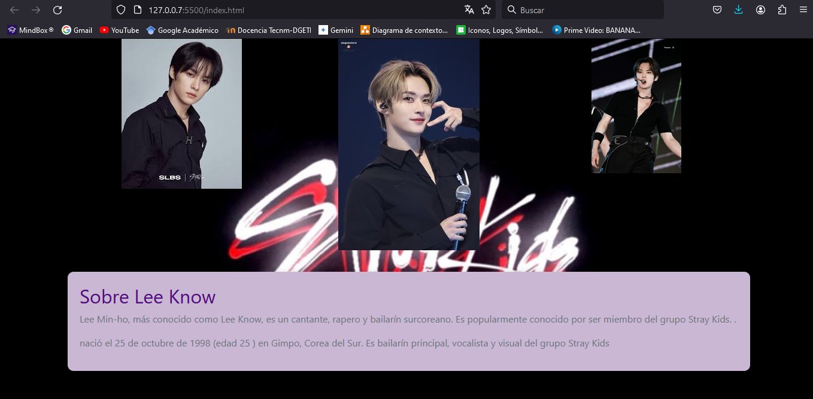

# Mi primer proyecto con BOOTSTRAP de Tecnolochicas PRO

Este primera pagina web con bootstrap fue diseñada en clases del curso de TECNOLOCHICAS-PRO

Fue desarrollado con HTML, CSS y JS con el uso de framework Bootstrap.

[Proyecto en linea](https://bootstrapeli.netlify.app/)

- Capturas de pantalla

- Tecnologías

* HTML
* CSS
* Bootstrap 5

Creado por Elizabeth Joaquin en el bootcamp de Technolochicas PRO.